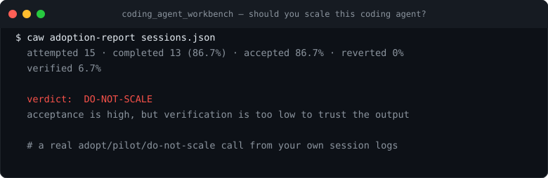

# Coding Agent Workbench

[](https://github.com/yingchen-coding/coding_agent_workbench/actions/workflows/ci.yml)
[](pyproject.toml)
[](LICENSE)



Evaluate coding-agent attempts with deterministic checks instead of vibes.

The workbench takes a JSON attempt record and grades whether an agent produced a small, tested,
reviewable, safe change. It is designed for local benchmarks, team dogfooding, and public demos
where the important question is:

> Did the agent actually complete the coding task without hidden regressions or risky edits?

## Star This If

- You run coding agents and want an adopt / pilot / do-not-scale call, not a gut feeling.
- You want deterministic scoring of completion, acceptance, revert, and verification rates.
- You need a reproducible way to compare agents on your own session records.

## Why It Matters

Coding-agent adoption is easy to overstate. Token volume, chat count, or "developer activity" do
not prove that useful work landed. The workbench focuses on the evidence that matters:

- Was there a concrete task?
- Did the agent change a bounded set of files?
- Were tests or verification commands recorded?
- Did the diff introduce risky patterns or private data?
- Would a reviewer accept this as a real completed change?

Use it to compare agents, dogfood local workflows, or turn messy agent traces into an honest
engineering scorecard.

## Install

```bash
python -m pip install -e .
```

## Quick Start

Evaluate an example:

```bash
python -m coding_agent_workbench evaluate examples/good_attempt.json --format table
```

Create a blank attempt template:

```bash
python -m coding_agent_workbench init-attempt --task-id parser-null-handling --out attempt.json
```

List scoring checks:

```bash
python -m coding_agent_workbench list-checks
```

Summarize adoption without confusing usage growth for task success:

```bash
python -m coding_agent_workbench adoption-report examples/adoption_signals.json --format markdown
```

Audit whether raw context truncation drops the active request:

```bash
python -m coding_agent_workbench context-audit ~/.claude/projects --budget 256
```

## What It Scores

- tests passed or failed
- whether verification commands were recorded
- diff size and file-count blast radius
- risky code patterns such as dynamic execution, destructive shell, or committed secrets
- privacy leaks in diff text
- weak commit messages
- missing evidence for the stated task

## Context Retention Audits

`context-audit` streams coding-agent JSONL transcripts and compares two equal-budget policies:

- raw tail truncation over text, tool-call, and tool-result events
- active human request first, followed by recent non-request context

It filters compact summaries, sidechains, metadata, and tool results out of the human-request role;
uses case-insensitive exact lexical anchors; reports one case per request; and uses
session-balanced, session-clustered inference. Malformed input counts are reported instead of
silently discarded. Output is aggregate-only: no transcript text, anchors, or paths.

A version `0.2.0` field run on July 25, 2026, over one private local corpus produced 190 eligible
cases across 117 sessions. At 256 whitespace tokens, session-balanced exact lexical retention
increased from `0.422` to `0.707` (`+0.285`, cluster-bootstrap 95% CI `[0.214, 0.351]`). In the
95-case stratum without an individually oversized intervening message, the delta remained `+0.114`
(95% CI `[0.020, 0.205]`). The aggregate [result snapshot](examples/context_audit_2026-07-25.json)
preserves the corpus fingerprint and parse-error counts. The private corpus is not published, so
the snapshot is auditable but not independently reproducible.

This is an outcome-conditioned lexical-retention result. It is not task success, answer quality,
semantic retention, causality, or evidence that the effect generalizes across users.

## Adoption Reports

`adoption-report` turns weekly or monthly coding-agent rollout records into a grounded adoption
verdict. It requires task denominators, not just token volume or headline usage growth.

Each record can include:

```json
{
  "tool": "local-coding-agent",
  "period": "2026-W26",
  "workflow": "small bug fixes",
  "attempted_tasks": 10,
  "completed_tasks": 8,
  "accepted_changes": 8,
  "reverted_changes": 0,
  "verified_tasks": 9,
  "tokens": 240000,
  "cost": 9.6
}
```

The report emits completion rate, acceptance rate, revert rate, verification coverage, cost per
completed task, and an `adopt` / `pilot` / `do-not-scale` verdict. This keeps coding-agent
adoption claims honest: usage is interesting, but verified completed work is the signal.

## Attempt Schema

```json
{
  "task_id": "parser-null-handling",
  "goal": "Handle null values in the parser without changing output schema.",
  "changed_files": ["src/parser.py", "tests/test_parser.py"],
  "verification": [
    {"command": "pytest tests/test_parser.py -q", "status": "passed"}
  ],
  "diff_text": "... unified diff or extracted patch text ...",
  "commit_message": "Handle null parser values",
  "notes": "Short evidence summary."
}
```
